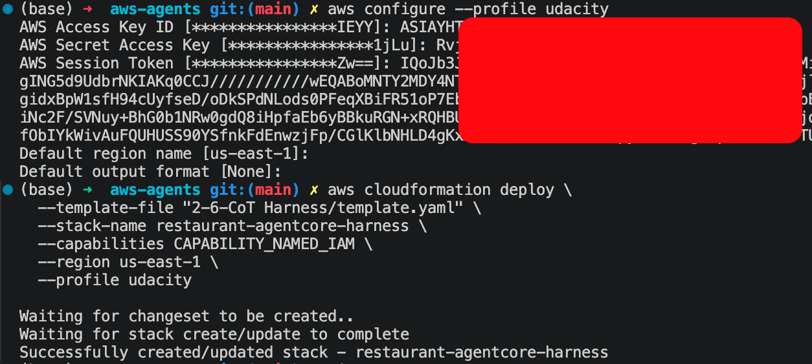
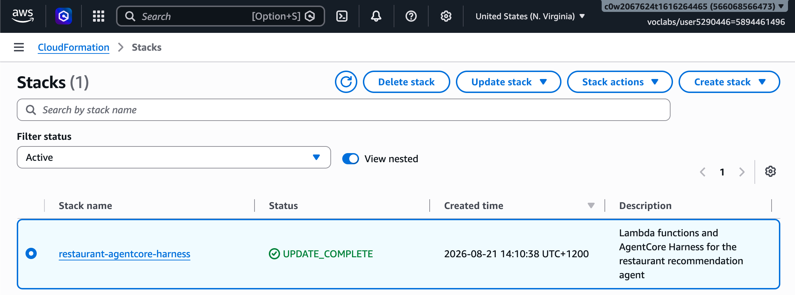
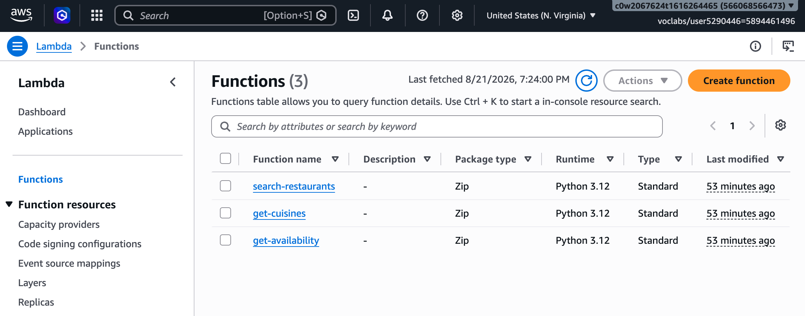
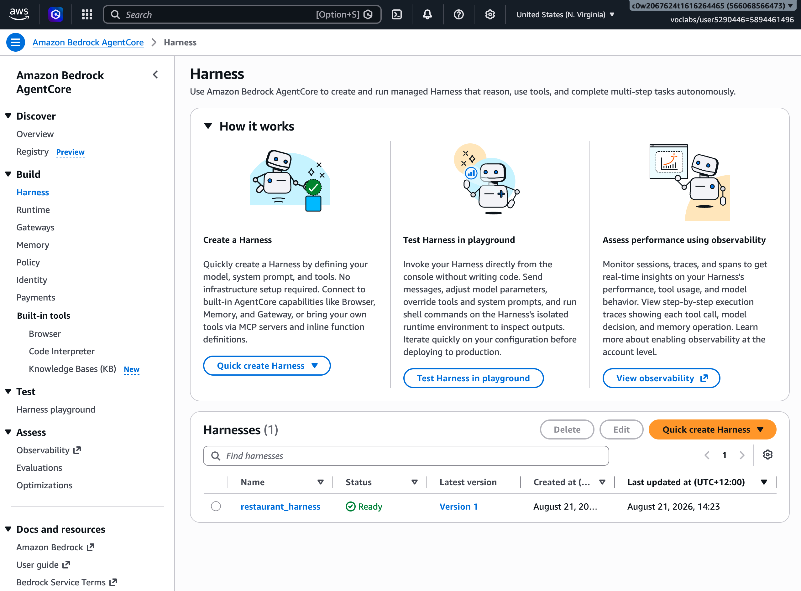

# Exercise Solution: Restaurant Recommendation Agent

## A. Template
The CloudFormation template converting from classing Agent to AgentCore Gateway [template](template.yaml)

Open the file to review the changes for converting.

## B. Deployment

### Deploy stack

Run the command in terminal
```bash
aws-agents git:(main) ✗ aws configure --profile udacity
aws-agents git:(main) ✗ aws cloudformation deploy \    
  --template-file "2-6-CoT Harness/template.yaml" \
  --stack-name restaurant-agentcore-harness \
  --capabilities CAPABILITY_NAMED_IAM \
  --region us-east-1 \
  --profile udacity
```
The result is similar to the following image.


###  Check the deployment status



### Lambda functions




### Harness



#### Harness detail


#### Gateway


### Test


### Tools calling results


