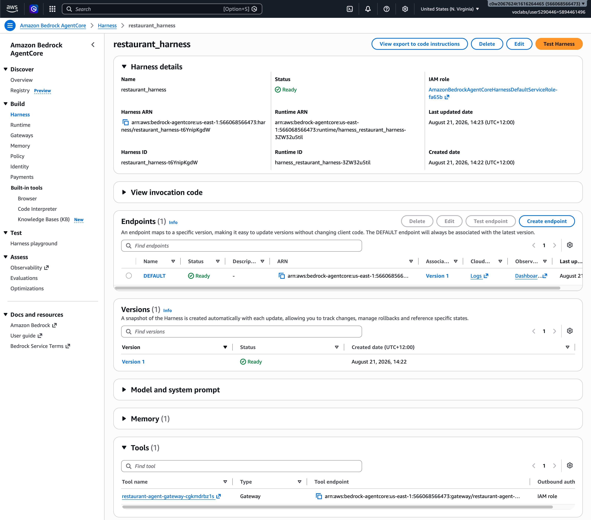
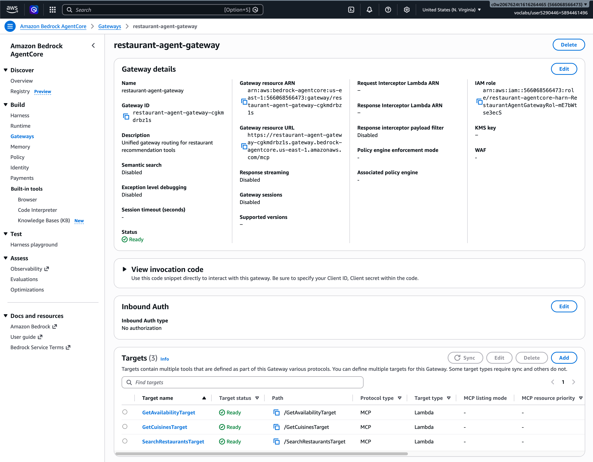
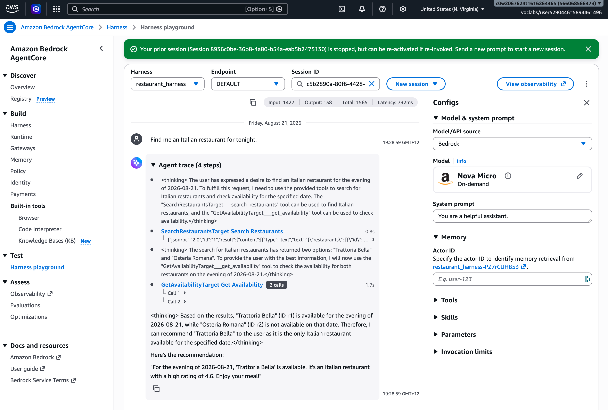
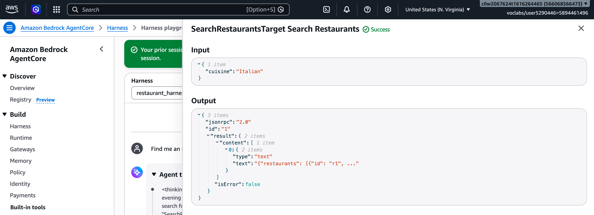
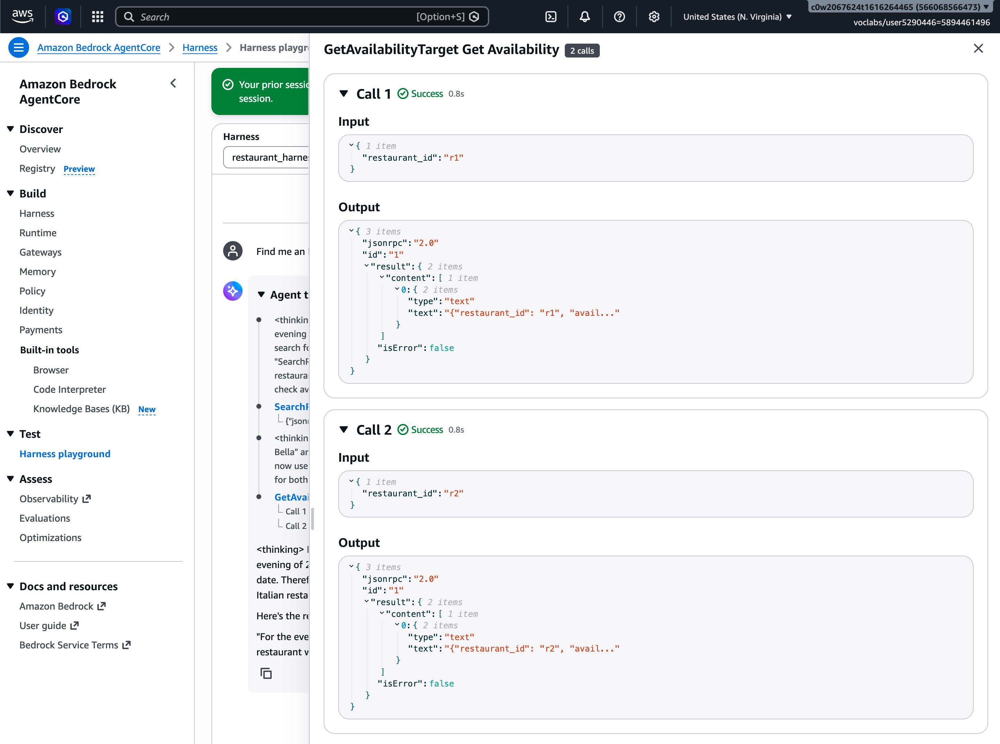

# Exercise Solution: Restaurant Recommendation Agent


[CloudFormation converting to AgentCore Gateway](template.yaml)

### Deploy stack
```bash
aws-agents git:(main) ✗ aws configure --profile udacity
aws-agents git:(main) ✗ aws cloudformation deploy \    
  --template-file "2-6-CoT Harness/template.yaml" \
  --stack-name restaurant-agentcore-harness \
  --capabilities CAPABILITY_NAMED_IAM \
  --region us-east-1 \
  --profile udacity
```

###  Check the deployment status


### Lambda functions


### Harness


#### Harness detail



#### Gateway



### Test



### Tools calling results



